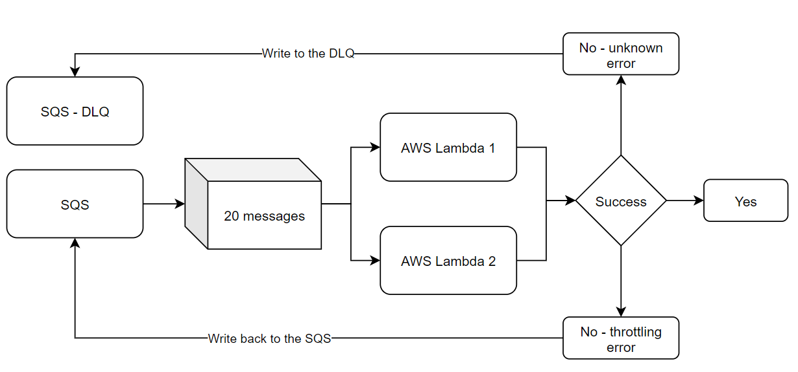
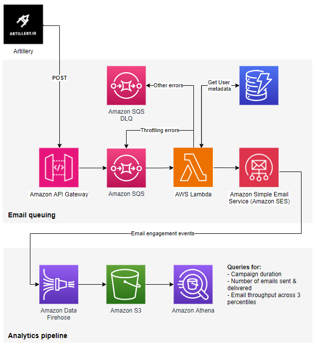
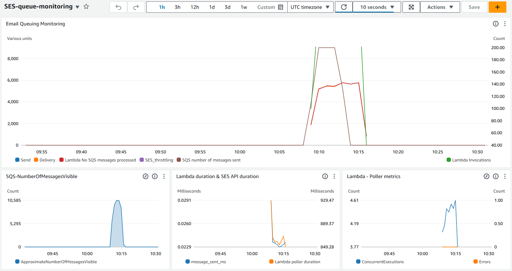

### SES Load Testing Solution

### Description

This solution is designed to support Amazon SES (Simple Email Service) users in queuing and sending bulk emails while maintaining control over error handling, personalization, and throughput testing. It enables email performance monitoring by capturing and analyzing event data through Amazon Athena and CloudWatch. The solution deploys key AWS services using the AWS Cloud Development Kit (CDK).

### Key Features:
- **Queue Emails & Handle Errors**: Efficiently queue large numbers of emails and manage failures.
- **Personalize Emails**: Dynamically generate emails using customer metadata stored in DynamoDB.
- **Throughput Testing**: Simulate different levels of email traffic to assess performance.
- **Analytics & Monitoring**: Capture email events and analyze them using Amazon Athena and monitor metrics in CloudWatch.

### Table of Contents

1. [Solution Queuing Mechanics](#solution-queuing-mechanics)
2. [Architecture Overview](#architecture-overview)
3. [Prerequisites](#prerequisites)
4. [Deployment Steps](#deployment-steps)
   1. [Clone the Repository](#clone-the-repository)
   2. [Bootstrap AWS Environment](#bootstrap-aws-environment)
   3. [Deploy the CDK Stacks](#deploy-the-cdk-stacks)
   4. [Retrieve the API Gateway Endpoint](#retrieve-the-api-gateway-endpoint)
   5. [Retrieve the API Key](#retrieve-the-api-key)
5. [Configuring Artillery for Load Testing](#configuring-artillery-for-load-testing)
   1. [Update LoadTest.yaml](#update-loadtestyaml)
   2. [Edit LoadTestFunction.js](#edit-loadtestfunctionjs)
   3. [Run the Load Test](#run-the-load-test)
6. [Monitoring and Analyzing Performance](#monitoring-and-analyzing-performance)
   1. [CloudWatch Monitoring](#cloudwatch-monitoring)
   2. [Analyzing Email Events in Athena](#analyzing-email-events-in-athena)

### Solution queuing mechanics

Amazon SES has a maximum sending rate, also known as throughput, which refers to the number of emails you can send per second. Initially, your SES account is in the Sandbox, limiting you to sending one email per second. To increase this limit, follow the instructions outlined on [this page](https://docs.aws.amazon.com/ses/latest/dg/request-production-access.html).

Sending an email using the SES API or SDK generally takes between 40 to 60 milliseconds. The exact duration can vary based on factors like the AWS region, the memory allocated to your AWS Lambda function, whether the function is in a warm state, and any pre-processing steps before sending the email. With an average API call duration of 50 ms, an AWS Lambda function can process roughly 20 emails per second. Therefore, it’s advisable to configure the SQS batch size to 20 messages, with each message corresponding to an email for a single recipient. Be sure to consider the potential for longer API call durations.

To achieve a higher throughput, such as 40 emails per second, you will need to run multiple AWS Lambda functions concurrently. For instance, setting the AWS Lambda reserved concurrency to 2 will allow you to reach an estimated throughput of 40 emails per second.

If the SES API returns a throttling error, the Lambda poller will requeue the message in the SQS Standard Queue. For any other errors, the message will be sent to a Dead Letter Queue (DLQ), which is part of the solution's deployment.

The solution provides the flexibility to configure both the SQS batch size and Lambda concurrency at deployment, enabling you to achieve your desired throughput while staying within your SES account limits. Additionally, it deploys a CloudWatch dashboard that monitors various metrics, including the average Lambda processing time. These metrics can guide you in adjusting the SQS batch size and Lambda concurrency as needed.

**IMPORTANT:** AWS Lambda concurrency does not have a straightforward linear relationship with the number of messages processed. For example, a Lambda concurrency of 4 with an SQS batch size of 20 won’t necessarily yield 80 transactions per second (TPS). This behavior is due to the mechanics of Lambda and SQS integration. In practice, achieving the desired processing rate often requires configuring a higher concurrency. For instance, you may need to set the Lambda concurrency to 7 to have 4 Lambdas processing SQS messages concurrently.

The solution includes a CloudWatch dashboard that provides visibility into various metrics. You can use this dashboard to fine-tune the Lambda concurrency and SQS batch size as needed.



### Architecture Overview

1. **Artillery**: This solution uses Artillery to simulate email traffic. Artillery is a scalable, flexible, and easy-to-use platform that provides everything needed for production-grade load testing.
2. **Amazon API Gateway**: Provides a secure endpoint for applications to send emails. The solution secures the API Gateway endpoint using API Key protection.
3. **Amazon SQS**: A standard queue is used to manage the queuing of emails. The batch size can be configured either during or after deployment.
4. **AWS Lambda**: An AWS Lambda function processes messages from the SQS queue, queries Amazon DynamoDB for customer data, and sends emails via Amazon SES. If a throttling error is returned by the SES API, the message is re-queued. Any other errors result in the message being sent to a Dead Letter Queue (DLQ).
5. **Amazon DynamoDB**: Used to store customer data, such as first names, for message personalization. The solution includes dummy data in the DynamoDB table for testing purposes.
6. **Amazon SES**: The solution creates an SES email template named `SimpleEmail`, featuring placeholders for dynamic values like `first_name`, which is retrieved from DynamoDB based on the user ID, for personalization. It also includes a functional parameter called `unique_code`. This unique_code is generated when Artillery creates the message payload and is later used in Athena queries to ensure each message is delivered no more than once. The solution also creates an SES configuration set for event tracking purposes.
7. **Analytics' Pipeline**: Composed of Amazon Kinesis Data Firehose, which serves as one of the SES event destinations for capturing email engagement events, Amazon S3 for storing these events, and Amazon Athena for running SQL queries against the stored email engagement data.



### Prerequisites

1. **Verified SES Domain**: Make sure your domain is verified within SES. For guidance, visit the [Amazon SES identity creation guide](https://docs.aws.amazon.com/ses/latest/dg/creating-identities.html).
2. **SES in Production Mode**: It's recommended to use this solution for throughputs higher than 20 emails per second. Request production access in SES by following this [SES production access guide](https://docs.aws.amazon.com/ses/latest/dg/request-production-access.html).
3. **IAM Administrative Rights**: Ensure that you have administrative rights to deploy the resources.
4. **Install Artillery**: Install Artillery for performance load testing. [Get started with Artillery](https://www.artillery.io/docs/get-started/get-artillery).
5. **Install Node.js Dependencies**: Install necessary dependencies for the AWS CDK and TypeScript environment:
   ```bash
   npm install aws-cdk-lib constructs
   npm install --save-dev ts-node typescript
   ```

6. **Install/Upgrade AWS CDK CLI**: Make sure to install or upgrade AWS CDK to the latest version:
   ```bash
   npm install -g aws-cdk
   ```

### Deployment Steps

To deploy the solution effectively, the following inputs and configurations are required across the CDK stacks. Open the [config.params.json](config.params.json) file, which should contain the below

``` JSON
{
  "eventAthenaDatabaseName": "ses-events",
  "newConfigurationSet": "Yes",
  "configurationSetName": "load-test-config",
  "sqsBatchSize": 20,
  "reservedLambdaConcurrency": 1,
  "cloudwatchDashboardName": "SES-queue-monitoring",
  "apiGatewayName": "ses-endpoint-queue"
}
```
- **eventAthenaDatabaseName**: Leave the default value or define a custom name for the Amazon Athena database.
- **NewConfigurationSet**: Leave the default value to `Yes` to create a new SES configuration set during the deployment. 
- **ConfigurationSetName**: The name of the SES configuration set that will be used to monitor the email sending process.
- **SQSBatchSize**: Defines the number of messages processed in each SQS batch. This determines how many messages the Lambda function will process in one invocation.
- **ReservedLambdaConcurrency**: Configure the reserved concurrency for the Lambda function to control the number of messages processed per second. Ensure the concurrency value supports the desired throughput (e.g., processing SQS batches in one second).
- **DashboardName**: Leave the default value or define a custom name for the CloudWatch dashboard that will display SES metrics.
- **ApiGatewayName**: Leave the default value or define a custom name for the API Gateway that will be used to send email data to. 


1. **Clone the Repository**
   - Clone the SES load testing solution repository to your local machine:
     ```bash
     git clone git@github.com:aws-samples/load-testing-sample-amazon-ses.git
     ```

2. **Bootstrap AWS Environment**
   - If this is your first time deploying a CDK project in your AWS account/region, bootstrap the environment:
     ```bash
     cdk bootstrap
     `````

3. **Deploy the CDK Stacks**
The solution is composed of three CDK stacks:

- **`sesQueueStack`**: Deploys all necessary resources for message queuing, including API Gateway, SQS, Lambda, and DynamoDB.
- **`PipelineStack`**: Deploys resources for the email analytics pipeline, such as Kinesis Data Firehose, an S3 bucket, and Athena.
- **`TestUserDataStack`**: Populates DynamoDB with test user data.

To deploy the solution, use the command below to deploy all three CDK stacks:

     ```bash
     cdk deploy PipelineStack sesQueueStack TestUserDataStack
     ```

6. **Retrieve the API Gateway Endpoint**
   - After deployment, retrieve the `SESqueueStack.apiGatewayInvokeURL` output, which is the API endpoint for sending messages to SQS via API Gateway.
   - Example URL format: `https://xxxxxx.execute-api.aws-region.amazonaws.com/send_messages/`

7. **Retrieve the API Key**
   - After deployment, retrieve the `SESqueueStack.ApiKeyValue` output, which is the API key for accessing the API Gateway.

## Configuring Artillery for Load Testing

Once the solution is deployed, you can configure Artillery to perform email load testing.

### 1. **Update LoadTest.yaml**

- Open [LoadTest.yaml](artillery/LoadTest.yaml). In this file, you will specify the following parameters:
  - **target**: Your API Gateway endpoint, which can be obtained from the CDK deployment outputs. It should look like `https://xxxx.execute-api.xxxx.amazonaws.com/send_messages`.
  - **duration**: The duration of the load test, specified in seconds.
  - **arrivalRate**: The rate at which Artillery will send requests to your API Gateway to write messages.
  - **url**: The API Gateway path where Artillery will perform `POST` calls.
  - **x-api-key**: Your API Gateway key, which can be obtained from the CDK deployment outputs.
- Perform the relevant updates, save and close the `LoadTest.yaml` file.

The parameters under `json` are dynamically populated by `LoadTestFunction.js`, which is explained in the `Edit LoadTestFunction.js` section detail below.
   
Example LoadTest.yaml:
   ```yaml
   config:
   target: 'https://your-api-gateway-endpoint.amazonaws.com/send_messages'
   phases:
      - duration: 60
         arrivalRate: 10
   scenarios:
   - flow:
      - function: "generateMessages"
      - post:
         url: "/events"
         headers:
            x-api-key: "your-api-key"
         json:
            from: "{{ from }}"
            to: "{{ to }}"
            template_name: "{{ template_name }}"
            user_id: "{{ user_id }}"
            config_set: "{{ config_set }}"
            tags: "{{ tags }}"
            unique_code: "{{ unique_code }}"
   ```

### 2. **Edit LoadTestFunction.js**
   - Open the [LoadTestFunction.js](artillery/LoadTestFunction.js) In this file, you will specify the following parameters:
     - **from**: Set your verified SES email address that will be used to send emails. This address should be from a domain that you own and have verified in SES.
     - **config_set**: The SES configuration set the solution will use to publish all email engagement events. Leave the default value `load-test-config` if you haven't changed it when deploying the solution.
     - **tags**: This field is used to define SES tags, which are added when sending an email and returned as part of the email engagement events. The solution uses a custom tag named `campaign` to distinguish one load testing run from another. Make sure to update the tag value each time you initiate a new load test.
   - Context for the Remaining Parameters:
     - **to**: For testing, it is recommended to use [SES simulator](https://docs.aws.amazon.com/ses/latest/dg/send-an-email-from-console.html) email addresses to avoid unintended deliveries.
     - **template_name**: The name of the SES template created specifically for load testing purposes.
     - **user_id**: A random integer between 1 and 10,000, representing a customer ID. This ID is used to query the DynamoDB table and retrieve the corresponding customer data.
     - **unique_code**: A unique identifier generated when writing messages to SQS. It is later used in Athena queries to verify that each email is sent only once.

Example LoadTestFunction.js
```JS
userContext.vars.from = "sender@example.com"
userContext.vars.to = "success@simulator.amazonses.com"
userContext.vars.template_name = "SimpleEmail"
userContext.vars.user_id = generateUserId()
userContext.vars.config_set = "load-test-config"
userContext.vars.tags = [{"Name":"campaign","Value":"run1"}]
userContext.vars.unique_code = generateUniqueCode()
```

### 3. **Run the Load Test**
   - Once the configurations are complete, navigate to the `artillery` folder and execute the command below to run the load test:
     ```bash
     artillery run-lambda --region us-east-1 LoadTest.yaml
     ```

   - Monitor the CloudWatch dashboard to view metrics such as email send rates, processing times, and errors.

## Monitoring and Analyzing Performance

### 1. **CloudWatch Monitoring**
After running the load test, go to your CloudWatch dashboard to monitor the performance of email sending and Lambda execution. The dashboard includes the following widgets:
- **Email Queuing Monitoring**: This graph displays the number of messages written to SQS, the number of SQS messages processed, the number of emails sent via SES, delivery statistics, and any throttling errors.
- **SQS Number of Messages Visible**: This graph shows the count of visible messages in the SQS queue. If the rate at which messages are written to the queue exceeds the processing rate, you’ll see a spike, which should decrease gradually as SES handles the load.
- **Lambda Duration & SES API Duration**: This graph illustrates the average time taken to make an SES `send_email` API call and the average duration for a Lambda function to process a batch from SQS.
- **Lambda Poller Metrics**: Displays the average concurrency of Lambda functions.

   

### 2. **Analyzing Email Events in Athena**
   - Email sending events are captured and stored in the Amazon Athena database created during the deployment. Navigate to the [Amazon Athena Console](https://console.aws.amazon.com/athena/) and select your Athena database.
   - You can run queries to analyze event types (e.g., deliveries, bounces, complaints). Use the pre-built queries from the [SQL-queries.md](assets/SQL-queries.md) file for your analysis.

   Example query:
   ```sql
   SELECT eventType, COUNT(*) as event_count
   FROM ses_events_table
   GROUP BY eventType;
   ```
