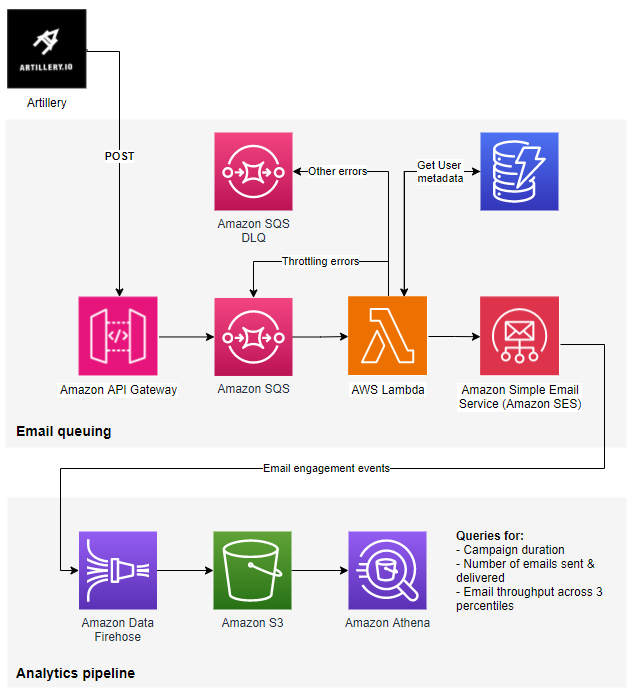

### SES Load Testing Solution

## Description

This solution is designed to assist Amazon SES (Simple Email Service) customers in queuing and sending bulk emails while maintaining control over error handling, personalization, and throughput testing. It enables email performance monitoring by capturing and analyzing event data through Amazon Athena and CloudWatch. The solution deploys key AWS services using the AWS Cloud Development Kit (CDK).

### Key Features:
- **Queue Emails & Handle Errors**: Efficiently queue large numbers of emails and manage failures.
- **Personalize Emails**: Dynamically generate emails using customer metadata stored in DynamoDB.
- **Throughput Testing**: Simulate different levels of email traffic to assess performance.
- **Analytics & Monitoring**: Capture email events and analyze them using Amazon Athena and monitor metrics in CloudWatch.

### Architecture Overview

The solution involves several AWS services including Amazon SES, AWS Lambda, Amazon SQS, Amazon DynamoDB, Amazon API Gateway, Amazon CloudWatch, and Amazon Athena. The architecture can be visualized in the attached architecture diagram.



## Prerequisites

1. **Verified SES Domain**: Make sure your domain is verified within SES. For guidance, visit the [Amazon SES identity creation guide](https://docs.aws.amazon.com/ses/latest/dg/creating-identities.html).
2. **SES in Production Mode**: If you need to send more than one email per second, request production access in SES by following this [SES production access guide](https://docs.aws.amazon.com/ses/latest/dg/request-production-access.html).
3. **IAM Administrative Rights**: Ensure that you have administrative rights to deploy the resources.
4. **Install Artillery**: Install Artillery for performance load testing. [Get started with Artillery](https://www.artillery.io/docs/get-started/get-artillery).
5. **Install Node.js Dependencies**: Install necessary dependencies for the AWS CDK and TypeScript environment:
   ```bash
   npm install aws-cdk-lib constructs
   npm install --save-dev ts-node typescript
   ```

6. **Install/Upgrade AWS CDK CLI**: Make sure to install or upgrade AWS CDK to the latest version:
   ```bash
   npm install -g aws-cdk
   ```

## Inputs Under CDK

To deploy the solution effectively, the following inputs and configurations are required across the CDK stacks. Open the `cdk.ts` file located in the repository directory (`repository/cdk/bin/cdk.ts`) and configure the following values:

### **PipelineStack:**
- **aws_region**: The AWS region in which the solution is to be deployed (e.g., `'us-east-1'`).
- **EventAthenaDatabaseName**: Define a name for the Amazon Athena database, which will store email event data.
- **CreateBucketName**: A unique name for the S3 bucket where email events and other analytics data will be stored. Note that S3 bucket names must be globally unique.
- **NewConfigurationSet**: Set to `true` to create a new SES configuration set during the deployment.
- **ConfigurationSetName**: The name of the SES configuration set that will be used to monitor the email sending process.

### **sesQueueStack:**
- **SQSBatchSize**: Defines the number of messages processed in each SQS batch. This determines how many messages the Lambda function will process in one invocation.
- **ReservedLambdaConcurrency**: Configure the reserved concurrency for the Lambda function to control the number of messages processed per second. Ensure the concurrency value supports the desired throughput (e.g., processing SQS batches in one second).
- **DashboardName**: Set a custom name for the CloudWatch dashboard that will display SES metrics.
- **ApiGatewayName**: Set the name of the API Gateway that will be used to send email data to SQS.

### **TestUserDataStack:**
- This stack is responsible for populating the DynamoDB table with customer metadata (e.g., names and email addresses). The stack includes 10,000 test user records for simulation purposes.

### Deployment Steps

1. **Clone the Repository**
   - Clone the SES load testing solution repository to your local machine:
     ```bash
     git clone git@github.com:aws-samples/load-testing-sample-amazon-ses.git
     ```

2. **Update the CDK Configuration**
   - Navigate to `repository/cdk/bin/cdk.ts` and update the input parameters for **PipelineStack**, **sesQueueStack**, and **TestUserDataStack** with your AWS details.

3. **Bootstrap AWS Environment**
   - If this is your first time deploying a CDK project in your AWS account/region, bootstrap the environment. Replace `ACCOUNT-NUMBER` and `REGION` with your AWS account number and the region of deployment:
     ```bash
     cdk bootstrap aws://ACCOUNT-NUMBER/REGION (--profile profile_name)
     ```

4. **Synthesize the CloudFormation Templates**
   - Synthesize the CloudFormation templates that define the infrastructure:
     ```bash
     cdk synth (--profile profile_name)
     ```

5. **Deploy the CDK Stacks**
   - Deploy the CDK stacks for Pipeline, SQS queue, and test data population:
     ```bash
     cdk deploy PipelineStack sesQueueStack TestUserDataStack --profile profile_name
     ```

6. **Retrieve the API Gateway Endpoint**
   - After deployment, retrieve the `SESqueueStack.apiGatewayInvokeURL` output, which is the API endpoint for sending messages to SQS via API Gateway.
   - Example URL format: `https://xxxxxx.execute-api.aws-region.amazonaws.com/send_messages/`

7. **Retrieve the API Key**
   - After deployment, retrieve the `SESqueueStack.ApiKeyValue` output, which is the API key for accessing the API Gateway.

## Configuring Artillery for Load Testing

Once the solution is deployed, you can configure Artillery to perform email load testing.

### 1. **Update LoadTest.yaml**
   - Navigate to the `artillery` folder and open the `LoadTest.yaml` file. Replace the placeholder URL under `target` with your API Gateway endpoint from the deployment output.
   
   Example:
   ```yaml
   config:
   target: 'https://your-api-gateway-endpoint.amazonaws.com'
   phases:
      - duration: 60
         arrivalRate: 10
   scenarios:
      - flow:
         - post:
               url: "/send_messages/"
               headers:
               x-api-key: "your-api-key"
               json:
               key: "value"
   ```

### 2. **Edit LoadTestFunction.js**
   - Open the `LoadTestFunction.js` file in the same directory. Edit the following key parameters to match your SES configuration:
     - **from**: Set your verified SES email address that will be used to send emails.
     - **config_set**: Set the name of the SES configuration set.
     - **tags**: Define a unique tag to identify the test run.

### 3. **Run the Load Test**
   - Once the configurations are complete, you can run the load test:
     ```bash
     artillery run-lambda --region us-east-1 LoadTest.yaml
     ```

   - Monitor the CloudWatch dashboard to view metrics such as email send rates, processing times, and errors.

## Monitoring and Analyzing Performance

### 1. **CloudWatch Monitoring**
   - After running the load test, navigate to your CloudWatch dashboard to monitor email sending performance and Lambda execution metrics. The dashboard will display metrics such as throughput, errors, and Lambda invocations.

### 2. **Analyzing Email Events in Athena**
   - Email sending events are captured and stored in the Amazon Athena database created during the deployment. Navigate to the [Amazon Athena Console](https://console.aws.amazon.com/athena/) and select your Athena database.
   - You can run queries to analyze event types (e.g., deliveries, bounces, complaints). Use the pre-built queries from the [SQL-queries.md](https://github.com/aws-samples/load-testing-sample-amazon-ses/blob/main/SQL-queries.md) file for your analysis.

   Example query:
   ```sql
   SELECT eventType, COUNT(*) as event_count
   FROM ses_events_table
   GROUP BY eventType;
   ```

## Personalizing Emails Using DynamoDB

The SES load testing solution supports email personalization by integrating with DynamoDB. This is particularly useful when sending tailored content to customers based on their stored metadata.

### Steps to Personalize Emails:
1. **DynamoDB Integration**: The solution stores customer metadata such as names and email addresses in DynamoDB. This data is accessed during email generation to create personalized emails.
   
2. **Modify Email Templates**: The SES email templates used in this solution can be customized to include dynamic placeholders that are replaced with real customer data at runtime.

   Example:
   ```html
   <p>Hello {{user.firstName}},</p>
   <p>We have an exclusive offer for you!</p>
   ```

This flexibility allows you to simulate real-world email campaigns where the content is personalized for each recipient, helping to better evaluate SES performance under realistic conditions.

### Additional Resources

- **AWS SES Documentation**: [Creating and Verifying Identities](https://docs.aws.amazon.com/ses/latest/dg/creating-identities.html), [Requesting Production Access](https://docs.aws.amazon.com/ses/latest/dg/request-production-access.html)
- **AWS CDK Documentation**: [AWS CDK Guide](https://docs.aws.amazon.com/cdk/latest/guide/home.html)
- **Artillery Documentation**: [Artillery Official Docs](https://www.artillery.io/docs/)
